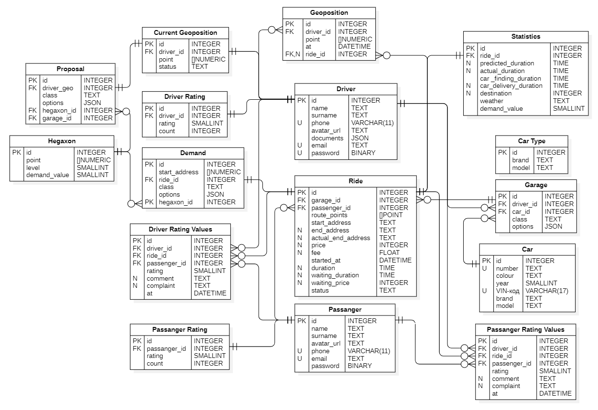

# Проектирование высоконагруженного приложения для сервиса Яндекс Такси

Работа в рамках предмета "Проектирование высоконагруженных приложений" программы "Веб-разработка" образовательного центра VK в МГТУ им. Баумана

Выполнила **Валова София**

## Содержание:
1. [Тема и целевая аудитория](#1)
2. [Расчет нагрузки](#2)
3. [Глобальная балансировка нагрузки](#3)
4. [Локальная балансировка нагрузки](#4)
5. [Логическая схема БД](#5)
6. [Физическая схема БД](#6)
7. [Алгоритмы](#7)

## 1. Тема и целевая аудитория БД 

Темой курсовой работы выбран агрегатор такси Яндекс.Такси

**Аудитория**

Согласно отчетам за второй квартал 2024 год аудитория сервиса составляет 49 млн пользователей в месяц, с увеличением аудитории на 16% от года к году [^1]

Основная аудитория это Россия, но так же сервис предоставляет услуги еще в 17 странах

**Функционал**

1. Указать адрес
2. Динамический расчет стоимости и времени поездок
3. "Маркетплейс" водителей и пользователей
4. Выйти на линию
5. Принять заказ
6. Рейтинг и отзывы на водителей
7. Оформить заказ
8. Отслеживание местоположения такси
9. Просмотр информации о заказе
10. Написать сообщение в чат
11. История заказов

**Продуктовые решения**
1. Предложить точку останова, если это сэкономит время и деньги пользователю
2. Совместные поездки
3. Кэшбэк баллами

## 2. Расчет нагрузки БД 

### Продуктовые метрики
- MAU - 49 млн
- DAU - 4 млн (в 2020 году [^2]), предположим, что сейчас 5 млн
- Средний размер хранилища пользователя:
  
| Хранимые данные   | Размер единицы                           | Количество на пользователя  | Размер на пользователя      | 
|-------------------|------------------------------------------|-----------------------------|-----------------------------|
| Персональные данные (ФИО, почта, пароль и т.д.) | `1 КБ`     | `1`                         | `1 Кб`                      |
| Аватар              | `200 Кб`                               | `1`                         | `200 Кб`                    |
| Сохраненные адреса  | `0,5 КБ`                               | `6`                         | `3 Кб`                      |
| История поездок*    | `60 Кб`                                | `150**`                     | `8800 Кб`                   |

*Расчет поездки: адреса, информация о водителе, стоимость, машина, дата, статус поездки, метаданные, маршрут и другое = 60 Кб 
** За 2023 было совершено 3,29 млрд поездок, яндекс такси занимает 80% рынка, тогда количество заказов через данный сервис составляет 2,5 млрд[^4] Получается в месяц 208 млн поездок, если MAU 49 млн, то в среднем совершается 4 поездки в месяц -> 50 поездок в год. Предположим, что средний пользователь пользуется такси 3 года -> 150 поездок 
**Итого** - 9 Мб * 50 млн = 430 Пб

- Среднее количество действий пользователя, водителя в день: 
**Оформление заказа:** `4 заказа/мес / 30 сут/мес = 0,13` 
**Посмотреть стоимость:** `0,13 * 3 = 0,4` предположим пользователь 2 раза проверит стоимость такси, на третий раз закажет 
**Выйти на линию:** `25` 
**Принять заказ:** `25` 
**Отслеживание местоположения такси:** `3*4 / 30 = 0,4` пользователя проверит местоположение 3 раза - после оформления, когда пройдет половина от времени, за которое такси должно приехать, и за 5 минут до приезда 
**Просмотр информации о поездке:** `2*4 / 30 = 0,27 ` пользователь совершит действие два раза: первый - чтоб ознакомитсья с машиной, второй - уточнить модель и номер машины

### Технические метрики
1. Размер хранения в разбивке по типам данных

| Тип                                 | Размер |
|-------------------------------------|--------|
| Фото                                | 9 Тб   |
| Данные о поездках                   | 140 Тб | 
| Данные о пользователях и таксистах  | 47 Гб  |

3. Сетевой трафик 
- Пиковое потребление в теченнии суток (в Гбит/с) - разбивка по существенным типам трафика (для выбора сетевых интерфейсов)
- Суммарный суточный (Гбайт/сутки) - разбивка по существенным типам трафика (опционально, для подсчета стоимости хостинга)

| Тип               | Суммарный                                                         | Пиковый                              |
|-------------------|-------------------------------------------------------------------|--------------------------------------|
| API               |`50к запросов * 86400 с * 2 Кб / (1024 * 1024) = 8200 Гбайт/сутки` |`82000 * 8 бит * 2 = 100к Гбит/с`|
| Статические файлы |`80 запросов * 86400 с * 200 Кб / (1024 * 1024) = 1300 Гбайт/сутки`|`1300 * 8 бит * 2 = 20к Гбит/с`       |

3. RPS в разбивке по типам запросов (запросов в секунду) - для основных запросов

| Тип                                    | Среднее | Пиковое |
|----------------------------------------|---------|---------|
| Оформление заказа***                   | 80      | 160     |
| Запрос на расчет стоимости поездок     | 240     | 480     |
| Выйти на линию                         | 80      | 160     |
| Отказаться от поездки                  | 7       | 10      |
| Отправка местоположения водителя ****  | 40к     | 80к     |

***7 млн поездок в день - 80 в секунду, в 2015 году пиковое значение было в 2,1 раза больше среднего [^3]  
****7 млн поездок в день, 25 поездок в день делает водитель => 280 000 водителей. Из наблюдения за экраном телефона таксиста во время поездки, задержка по отображению перемещения 2-3 секунды. Тогда пусть данные о местоположении отображаются каждые 2-3 секунды => в секунду ~100к запросов, будем также считать, что в пик работает 80% водителей (rps 80к пик, среднее в 2 раза меньше)

## 3. Глобальная балансировка нагрузки БД 

### Функциональное разбиение по доменам

taxi.yandex.ru - основной домен яндекс такси 
ride.taxi.yandex.ru - запросы, связанные с поездками: расчет цены, "маркетплейс" водителей и пользователей 
pro.taxi.yandex.ru  - запросы из Яндекс Про (приложение для водителей яндекс такси)  
user.taxi.yandex.ru - запросы от пользователей 

### Расположение ДЦ

Для обслуживания запросов по Россиии ДЦ расположим в Москве, Новосибирске, из средней азии запросы так же идут в Новосибирск, для европейских, африканских стран и ОАЭ - в Стамбуле.

### Расчет распределения запросов из секции "Расчет нагрузки" по типам запросов по датацентрам

66% пользователей Яндекс Такси из России, значит на Россию приходится 4,62 млн поездок/день и 2,64 млн пользователей. На остальные страны приходится 2,38 млн поездок/день и 1,36 млн пользователей/день. 
Количество поездок в центральной России составляет 60%. 
ДЦ в Москве обслуживает все запросы центральной России и является основным ДЦ. 
Локальные ДЦ принимаеют запросы от ride.taxi.yandex.ru и user.taxi.yandex.ru, то есть запросы на расчет цены поездок, составление маршрутов и запросы от водителей. Запросы от юзеров идут в Московский ДЦ.

| ДЦ                     | Млн пользователей/день | Млн поездок/день | RPS            | Запросы                                                          |
|------------------------|------------------------|------------------|----------------|------------------------------------------------------------------|
| Москва                 | 1,6                    | 2,8              | 20к            | Все для центральной России и действия юзеров                     |
| Новосибирск            |`1 + 0,68 = 1,68`      |`1,8 + 1,1 = 2,9`|`13 + 8к = 21к`| Расчет цены поездок, составление маршрутов, запросы от водителей |
| Стамбул                |  0,68                  |  1,1             | 8к             | Расчет цены поездок, составление маршрутов, запросы от водителей |

RPS по ДЦ и запросам

| ДЦ\Запрос              | Расчет стоимости поездки| Выйти на линию | Оформить заказ| Отправка местоположения водителя |
|------------------------|-------------------------|----------------|---------------|----------------------------------|
| Москва                 | 96                      | 32             | 80            | 16к                              |
| Новосибирск            |`40 + 64 = 106`          |`13 + 21 = 34  `| -             |`6,6к + 10к = 16,6к               |
| Стамбул                | 40                      | 13             | -             |6,6к                              |

### Схема DNS балансировки

Для балансировки использовать Geo-based DNS, так как расположение серверов обусловлено географией

## 4. Локальная балансировка нагрузки БД 
### Схема балансировки для входящих и межсерверных запросов

В качестве L7-балансировщика работает Envoy, алгоритмы балансировки: Least Connections для сервисов расчета цен и "маркетплейса водителей и пользователей" (так как это затратные по времени операции), для остальных - Round-Robin.

### Схема отказоустойчивости

Протокол VRRP позволяет нескольким хостам работать как единое целое, предоставляя один виртуальный IP-адрес. В случае отказа главного резервный автоматически становится главным

### Нагрузка по терминации SSL

SSL-терминация будет происходить на балансировщике. У ДЦ в Москве и Новосибирске ~20к rps, в Стамбуле 6к, рассчитаем для 20к: время на установление соединения - 300мс -> для обработки запросов потребуется 6000 с 

## 5. Логическая схема БД 

| Таблица             | Размер строки, байт | Кол-во записей | Объем | Чтение, Кбит/с | Запись, Кбит/с |
|---------------------|---------------------------|----------------|-------|--------|--------|
| ride                | 530  | 8 млрд  | 4 Тб   | *255* | *425* |
| driver              | 870  | 1 млн   | 830 Мб | *135* | *-* |
| passanger           | 370  | 300 млн | 100 Гб | *135* | *-* |
| car                 | 116  | 3 млн   | 330 Мб | *70* | *-* |
| garage              | 130  | 40 млн  | 4,8 ГБ | *82* | ** |
| type                | 64   | 100     | 6 Кб   | *-* | *-* |
| statistics          | 86   | 8 млрд  | 640 Гб | *-* | *53* |
| rating              | 14   | 80 млн  | 1 Гб   | *9* | *3* |
| driver rating values| 106  | 2,5 мдрд| 240 Гб   | *-* | *10* |
| passanger rating values|106| 2,5 млрд| 240 Гб   | *-* | *10* |
| geoposition         | 36   | 7 трлн  | 229 Тб | *-* | *10000* |
| current geoposition | 64   | 280 тыс | 17 Мб  | *22* | *14000* |
| *demand*            |*148* | *8 млрд+?* | *1 Тб* | *115* | *115* |
| *proposal*          |*128* | *8 млрд+?* | *950 Гб* | *66* | *82* |

## 6. Физическая схема БД 

### Запросы
| Таблица             | Запросы                |
|---------------------|------------------------|
| ride                |`INSERT INTO ride(passanger_id, start_address, end_address, price, status) ..`-создание заказа  `UPDATE ride SET garage_id=$1, points=$2, waiting_duration=$3, waiting_price=$4, status=$5, started_at=$6 WHERE id=$7`- начало поездки  `UPDATE ride SET price=$1, fee=$2, duration=$3, status=$4 WHERE id=$5`-завершение поездки  `SELECT id, garage_id, route_points, start_address, end_address, price, started_at, duration, status WHERE id=$1` - данные об определенной поездке  `SELECT id, garage_id, route_points, start_address, end_address, price, started_at, duration, status WHERE passanger_id=$1 ORDER BY started_at`-история поездок пользователя|
| driver/passanger rating |`UPDATE .. SET raiting=$1, count=$2 WHERE .._id=$3` - каждый раз, когда пользователя оценили  `SELECT rating FROM .. WHERE .._id=$1`|
| driver/passanger    | `SELECT .. FROM driver/passanger WHERE id=$1` - данные о водителях/пользователях  Запись происходит редко|
| current geoposition | `UPDATE сurrent_geoposition SET point=$1, status=$2 WHERE driver_id=$3` - каждые 3 секунды  `SELECT driver_id, point, status WHERE id=$1` |
| geoposition | `INSERT INTO сurrent_geoposition(driver_id, point, at, ride_id) ..` - каждые 3 секунды  `SELECT driver_id, point, at WHERE ride_id=$1 ORDER BY at`  `SELECT driver_id, point, at WHERE at<$1 AND at>$2` |
| car                 | `SELECT .. FROM car WHERE id=$1` - данные о машине по id|
| garage              | `SELECT driver_id, car_id, class, options FROM garage WHERE id=$1`|
| demand              | `INSERT INTO demand(start_address, ride_id, class, options, hegaxon_id) ..`  `SELECT id, start_address, ride_id, class, options, hegaxon_id FROM demand`|
| proposal            | `INSERT INTO proposal(driver_geo, class, options, hegaxon_id, garage_id) ..`  `SELECT id, driver_geo, class, options, hegaxon_id, garage_id FROM proposal`|

### Выбор БД
1. Основной БД для храненения данных является PostgreSQl
2. Сессии пользователей будут храниться в Redis
3. В таблице statistics хранятся данные по поездкам для аналитики, поэтому так же будем использовать Clickhouse
4. Таблица current-geoposition, proposal, demand должны быть быстро доступны, так как на основе их подбираются водители и пассажиры и рассчитываются цены, это должно происходить максимум за 100 мс. Так что эти таблицы будем хранить в Redis, так как она работает в оперативной памяти и и обеспечивает быстрый доступ к данным
5. Kafka для динамического ценообразования и расчета спроса, данные так же кешируются в Redis [^5]
6. S3-хранилище для хранения сгенерированных карт спроса и аватарок [^5]

### Индексы
Будем использовать BTree индекс, он хорошо подходит для столбцов , являющихся ключами
- **Ride:** по passanger_id, started_at
- **Current geoposition:** по driver_id
- **Geoposition:** по ride_id, at
- **Driver Rating:** по driver_id
- **Passanger Rating:** по passanger_id

### Клиентские библиотеки
- Postgres: https://github.com/jackc/pgx
- Redis: https://github.com/redis/go-redis
- Kafka: https://github.com/segmentio/kafka-go
- S3: https://github.com/aws/aws-sdk-go

### Шардирование, партицирование, резервирование
Таблица Ride довольна велика, Geoposition особенно велика, произведем партицирование(вертикальный шардинг) по полю started_at и at соответственно, по истечению определенного времени старые партиции удаляются

### Репликация
- Postgres: 1 мастер хост и 2 ведущих
- Clickhouse: поддерживает мультимастер репликацию, 2 мастер хоста и 2 ведущих

## 6. Алгоритмы 

### Распределение водителей по пассажирам

### Использованные источники
[^1]: [Презентация для инвесторов МКПАО "Яндекс" с данными за 2 квартал 2024](https://yastatic.net/s3/ir-docs/docs/2024/q2/57a1cu049ffbd144aeged36d47h173c2/IR_2Q2024_RUS_NEW.pdf)
[^2]: [Сколько пользователей пользуется Яндекс.Такси в день: статистика и актуальные данные](https://investim.guru/obzory/skolko-polzovateley-polzuetsya-yandeks-taksi-v-den-statistika-i-aktualnye-dannye)
[^3]: [Исследование Яндекс Такси в Москве](https://yandex.ru/company/researches/2015/moscow/taxi)
[^4]: [Численность поездок в такси в России в 2023](https://marketing.rbc.ru/articles/15040/)
[^5]: [Как устроена платформа динамиче­ского ценообразо­вания Яндекс Такси](https://dev.go.yandex/blog/dynamic-pricing-platform-2024-06-15)
[^6]: [System Design: Uber](https://dev.to/karanpratapsingh/system-design-uber-56b1)
[^7]: [Инструменты надежности Яндекс Такси](https://dev.go.yandex/blog/yandex-taxi-reliability-2024-05-30)
